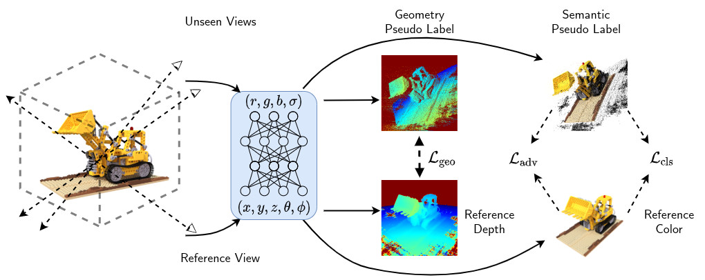

# SinNeRF: Training Neural Radiance Fields on Complex Scenes from a Single Image

[[Paper]](https://arxiv.org/abs/2204.00928) [[Website]](https://vita-group.github.io/SinNeRF/)

<div>


</div>

## Pipeline



## Code

### Environment

```
pip install -r requirements.txt
```

### Dataset Preparation

Please download the datasets from these links:

- NeRF synthetic: Download `nerf_synthetic.zip` from https://drive.google.com/drive/folders/128yBriW1IG_3NJ5Rp7APSTZsJqdJdfc1
- LLFF: Download `nerf_llff_data.zip` from https://drive.google.com/drive/folders/128yBriW1IG_3NJ5Rp7APSTZsJqdJdfc1
- DTU: Download the preprocessed DTU training data from https://drive.google.com/file/d/1eDjh-_bxKKnEuz5h-HXS7EDJn59clx6V/view

Please download the depth from here: https://drive.google.com/drive/folders/13Lc79Ox0k9Ih2o0Y9e_g_ky41Nx40eJw?usp=sharing

### Training

If you meet OOM issue, try:

1. enable `precision=16`
2. reduce the patch size `--patch_size` (or `--patch_size_x`, `--patch_size_y`) and enlarge the stride size `--sH`, `--sW`

<details>
  <summary>NeRF synthetic</summary>


- Step 1
  ```
  python train.py  --dataset_name blender_ray_patch_1image_rot3d  --root_dir  ../../dataset/nerf_synthetic/lego   --N_importance 64 --img_wh 400 400 --num_epochs 2000 --batch_size 1  --optimizer adam --lr 2e-4  --lr_scheduler steplr --decay_step 500 1000 --decay_gamma 0.5  --exp_name lego_s6 --with_ref --patch_size 64 --sW 6 --sH 6 --proj_weight 1 --depth_smooth_weight 0  --dis_weight 0 --num_gpus 4 --load_depth --depth_type nerf --model sinnerf --depth_weight 8 --vit_weight 10 --scan 4
  ```

- Step 2
  ```
  python train.py  --dataset_name blender_ray_patch_1image_rot3d  --root_dir  ../../dataset/nerf_synthetic/lego   --N_importance 64 --img_wh 400 400 --num_epochs 2000 --batch_size 1  --optimizer adam --lr 5e-5  --lr_scheduler steplr --decay_step 500 1000 --decay_gamma 0.5  --exp_name lego_s6_4ft --with_ref --patch_size 64 --sW 4 --sH 4 --proj_weight 1 --depth_smooth_weight 0  --dis_weight 0.01 --num_gpus 4 --load_depth --depth_type nerf --model sinnerf --depth_weight 8 --vit_weight 0 --pt_model xxx.ckpt --nerf_only  --scan 4
  ```

</details>

<details>
  <summary>LLFF</summary>

- Step 1
  ```
  python train.py  --dataset_name llff_ray_patch_1image_proj  --root_dir  ../../dataset/nerf_llff_data/room   --N_importance 64 --img_wh 504 378 --num_epochs 2000 --batch_size 1  --optimizer adam --lr 2e-4  --lr_scheduler steplr --decay_step 500 1000 --decay_gamma 0.5  --exp_name llff_room_s4 --with_ref --patch_size_x 63 --patch_size_y 84 --sW 4 --sH 4 --proj_weight 1 --depth_smooth_weight 0  --dis_weight 0 --num_gpus 4 --load_depth --depth_type nerf --model sinnerf --depth_weight 8 --vit_weight 10
  ```

- Step 2
  ```
  python train.py  --dataset_name llff_ray_patch_1image_proj  --root_dir  ../../dataset/nerf_llff_data/room   --N_importance 64 --img_wh 504 378 --num_epochs 2000 --batch_size 1  --optimizer adam --lr 5e-5  --lr_scheduler steplr --decay_step 500 1000 --decay_gamma 0.5  --exp_name llff_room_s4_2ft --with_ref --patch_size_x 63 --patch_size_y 84 --sW 2 --sH 2 --proj_weight 1 --depth_smooth_weight 0  --dis_weight 0.01 --num_gpus 4 --load_depth --depth_type nerf --model sinnerf --depth_weight 8 --vit_weight 0 --pt_model xxx.ckpt --nerf_only
  ```

</details>

<details>
  <summary>DTU</summary>

- Step 1
  ```
  python train.py  --dataset_name dtu_proj  --root_dir  ../../dataset/mvs_training/dtu   --N_importance 64 --img_wh 640 512 --num_epochs 2000 --batch_size 1  --optimizer adam --lr 2e-4  --lr_scheduler steplr --decay_step 500 1000 --decay_gamma 0.5  --exp_name dtu_scan4_s8 --with_ref --patch_size_y 70 --patch_size_x 56 --sW 8 --sH 8 --proj_weight 1 --depth_smooth_weight 0  --dis_weight 0 --num_gpus 4 --load_depth --depth_type nerf --model sinnerf --depth_weight 8 --vit_weight 10 --scan 4
  ```

- Step 2
  ```
  python train.py  --dataset_name dtu_proj  --root_dir  ../../dataset/mvs_training/dtu   --N_importance 64 --img_wh 640 512 --num_epochs 2000 --batch_size 1  --optimizer adam --lr 5e-5  --lr_scheduler steplr --decay_step 500 1000 --decay_gamma 0.5  --exp_name dtu_scan4_s8_4ft --with_ref --patch_size_y 70 --patch_size_x 56 --sW 4 --sH 4 --proj_weight 1 --depth_smooth_weight 0  --dis_weight 0.01 --num_gpus 4 --load_depth --depth_type nerf --model sinnerf --depth_weight 8 --vit_weight 0 --pt_model xxx.ckpt --nerf_only  --scan 4
  ```

More finetuning with smaller strides benefits reconstruction quality.

</details>


### Testing

```
python eval.py  --dataset_name llff  --root_dir /dataset/nerf_llff_data/room --N_importance 64 --img_wh 504 378 --model nerf --ckpt_path ckpts/room.ckpt --timestamp test
```

Please use `--split val` for NeRF synthetic dataset.

## Acknowledgement

Codebase based on https://github.com/kwea123/nerf_pl . Thanks for sharing!

## Citation

If you find this repo is helpful, please cite:

```

@InProceedings{Xu_2022_SinNeRF,
author = {Xu, Dejia and Jiang, Yifan and Wang, Peihao and Fan, Zhiwen and Shi, Humphrey and Wang, Zhangyang},
title = {SinNeRF: Training Neural Radiance Fields on Complex Scenes from a Single Image},
journal={arXiv preprint arXiv:2204.00928},
year={2022}
}

```

## DuoNeRF: two-reference training

This version adds a `duonerf` mode that trains one shared NeRF from two fixed
reference views, normally a front/back pair. Both references contribute RGB and
depth rays. At each iteration, one reference is selected and used to create a
nearby pseudo view for geometry and semantic regularization.

Required additions to the original SinNeRF data layout:

- Both reference images must already be listed in `transforms_train.json` with
  valid camera transforms.
- The two depth priors must exist under `depth_nerf/<image_stem>.npy` when
  `--depth_type nerf` is used.
- Select the pair explicitly with `--ref_indices FRONT_INDEX BACK_INDEX`.

Stage 1 example for Blender Lego:

```bash
python train.py \
  --dataset_name blender_ray_patch_2image_rot3d \
  --model duonerf \
  --root_dir ../datasets/downloaded_folder/nerf_synthetic/lego \
  --ref_indices 20 70 \
  --N_samples 32 --N_importance 32 \
  --img_wh 400 400 --num_epochs 2000 --batch_size 1 \
  --optimizer adam --lr 2e-4 --lr_scheduler steplr \
  --decay_step 500 1000 --decay_gamma 0.5 \
  --exp_name lego_duonerf_stage1 --with_ref \
  --patch_size 32 --sW 4 --sH 4 \
  --proj_weight 1 --depth_smooth_weight 0 --dis_weight 0 \
  --num_gpus 1 --load_depth --depth_type nerf \
  --depth_weight 8 --vit_weight 10 --angle 20
```

Stage 2 keeps the same two-reference dataset and loads the Stage 1 NeRF:

```bash
python train.py \
  --dataset_name blender_ray_patch_2image_rot3d \
  --model duonerf \
  --root_dir ../datasets/downloaded_folder/nerf_synthetic/lego \
  --ref_indices 20 70 \
  --N_samples 32 --N_importance 32 \
  --img_wh 400 400 --num_epochs 2000 --batch_size 1 \
  --optimizer adam --lr 5e-5 --lr_scheduler steplr \
  --decay_step 500 1000 --decay_gamma 0.5 \
  --exp_name lego_duonerf_stage2 --with_ref \
  --patch_size 32 --sW 4 --sH 4 \
  --proj_weight 1 --depth_smooth_weight 0 --dis_weight 0.01 \
  --num_gpus 1 --load_depth --depth_type nerf \
  --depth_weight 8 --vit_weight 0 --angle 20 \
  --pt_model ckpts/lego_duonerf_stage1/last.ckpt --nerf_only
```
